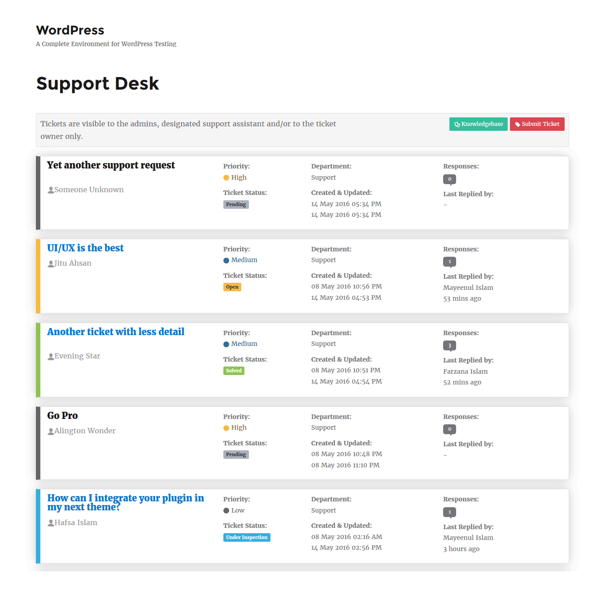
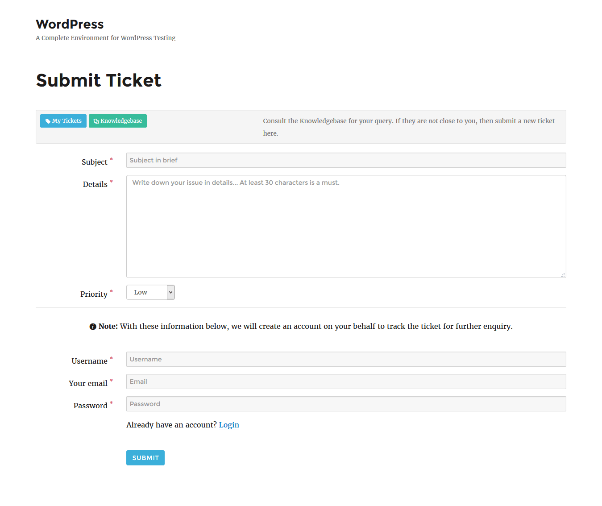
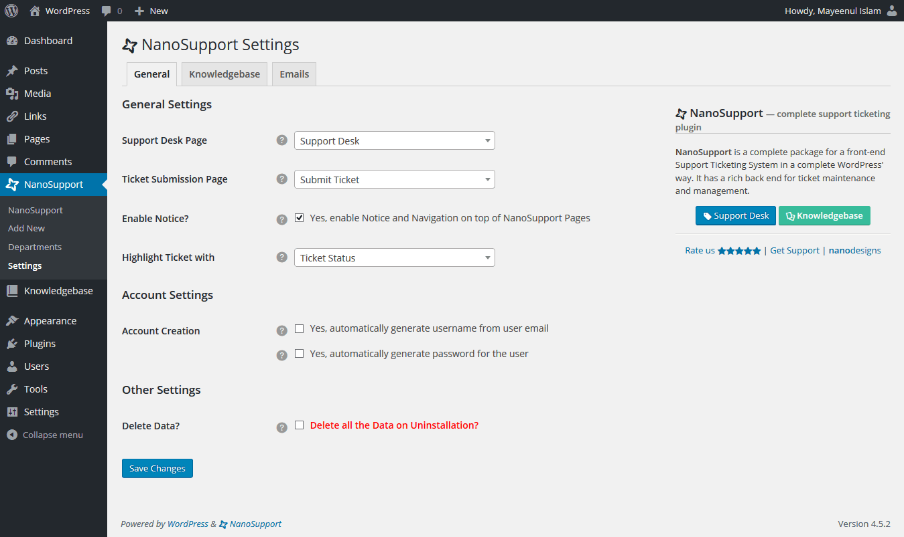
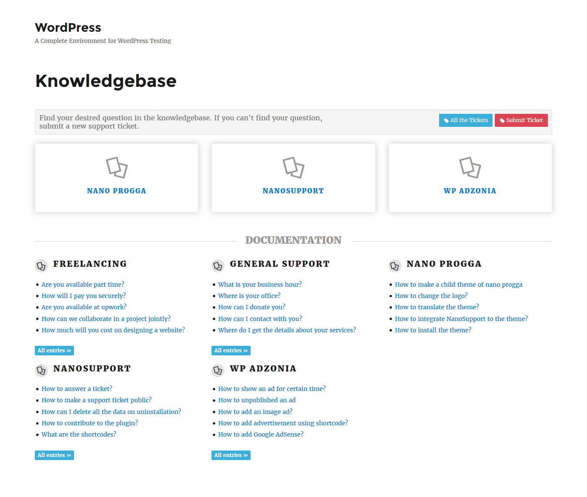
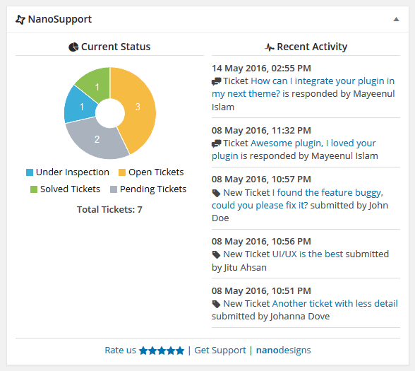
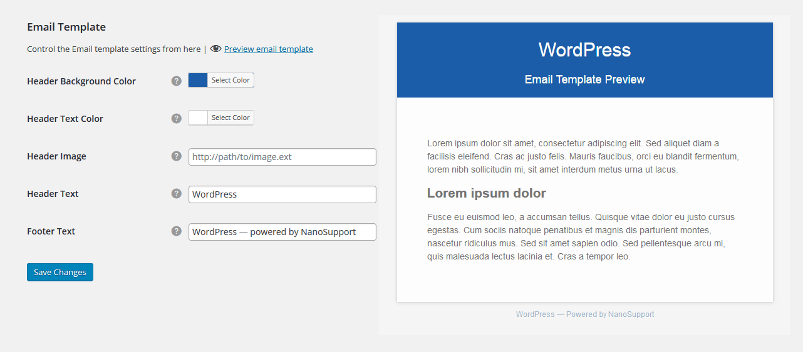
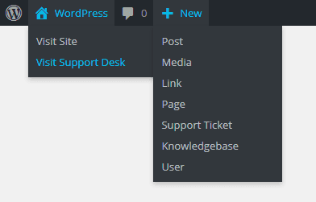

# NanoSupport <kbd>[**DOWNLOAD**](https://wordpress.org/plugins/nanosupport/)</kbd>
Smart Support Ticketing Plugin for WordPress

| Requires | Tested up to | Stable Release | w.org Rating | License | w.org Downloads |
|---|---|---|---|---|---|
| WordPress 4.4.0 |  |  |  | [GPL-2.0+](http://www.gnu.org/licenses/gpl-2.0.txt) |  |

## Introduction
Create a fully featured Support Center within your WordPress environment without any third party system dependency, for completely FREE of cost. **No** 3rd party support ticketing system required, **no** external site/api dependency, **simply** create your own fully featured Support Center within your WordPress environment, and take your support into the next level.

The plugin is to provide support to your users - the users those are taking product or services from you. So the plugin provides a managable communication privately in between you and your that specific user only. Visit the 'Installation' tab for more details on how to use the plugin.

[:white_check_mark: Read the List of its nice **Features**](https://github.com/nanodesigns/nanosupport/wiki/Introduction-&-Features)

---

[:notebook_with_decorative_cover: User Guide](https://github.com/nanodesigns/nanosupport/wiki) [:earth_asia: Translate](https://translate.wordpress.org/projects/wp-plugins/nanosupport)

### Contribute
NanoSupport is an Open Source and GPL licensed Free plugin. Feel free to contribute.

* [Fork on Github](https://github.com/nanodesigns/nanosupport)
* [Report Bug](https://github.com/nanodesigns/nanosupport/issues)
* [Get Support](http://wordpress.org/support/plugin/nanosupport)

### Available Automatic Translation
* Bengali (_Bangla_) - `bn_BD`

## Screenshots

<em>NanoSupport | Support Desk (front end)</em>

<em>NanoSupport | Support Tickets (back end)</em>

<em>NanoSupport | Submit Ticket page for Visitors</em>

<em>NanoSupport | Fully featured Settings page for complete customization</em>

<em>NanoSupport | Knowledgebase</em>

<em>NanoSupport | Ticketing at a glance with NanoSupport dashboard widget</em>

<em>NanoSupport | Customizable email template</em>

<em>NanoSupport | Easy navigation, and noticiation for easy ticketing using Admin bar</em>

## Changelog

### 0.2.1 - 2016-AUG-22
* `wp_kses()` is implemented to secure site from bad user input
* New filter hook: `ns_allowed_html`
* Tooltip made wider for large bunch of texts
* Stripping 'private' and 'protected' from ticket titles i18n-friendly
* Translation added: Bengali (_Bengali_) - `bn_BD`

### 0.2.0 - 2016-AUG-15
* Minimum WordPress version upgraded to 4.4.0
* Knowledgebase made optional
* UI added for selecting Knowledgebase Category Icons
* Added feature for closing a ticket from front end
* Tooltip added to Submit form for better UX
* Submit Form is made dynamic for adding feature to the `<form>` element
* Select2 Plugin updated to 4.0.3
* Knowledgebase CSS revamped
* Fixed a conflict with Yoast SEO and Select2 plugin in admin areas
* File organization, some CSS files made LESS for easy compilation
* JavaScript fallback plan implemented for front end
* Other fixes/UI improvements

### 0.1.1 - 2016-JUN-21
* A bug on Submit ticket is fixed

### 0.1.0 - 2016-JUN-17
* Plugin initiated

## Upgrade Notice

### 0.2.1
A major security hole was fixed

---
[**nano**designs](http://nanodesignsbd.com?ref=nanosupport) | [Twitter](https://twitter.com/nanodesigns/) | [Facebook](https://facebook.com/nanodesignsbd/) | [LinkedIn](http://www.linkedin.com/company/nanodesigns) | [Google+](https://google.com/+Nanodesignsbd)
